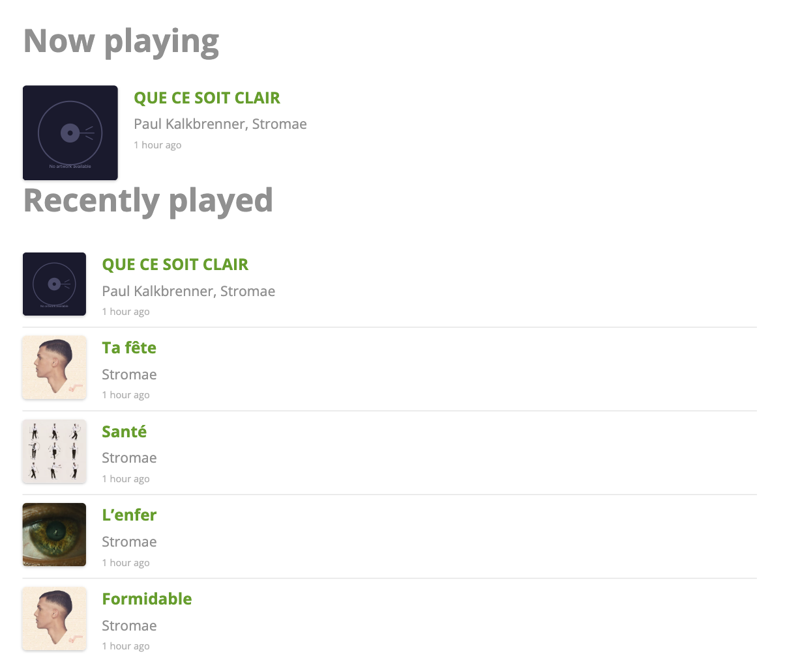

# Scrobbled Blocks

Display your Last.fm listening activity on your WordPress site with native Gutenberg blocks.

## Description

Scrobbled Blocks brings your Last.fm listening history to your WordPress site using native Gutenberg blocks. Whether you're a music blogger, podcaster, DJ, or just want to share your musical tastes with your audience, this plugin makes it simple.

### Blocks

**Now Playing Block** — Display the track you're currently listening to, or the most recent track you've played. Perfect for sidebars, footers, or anywhere you want to show off your current musical mood.

**Recently Played Block** — Show a list or grid of your recent scrobbles. Configurable from 1-20 tracks, with flexible layout options to match your site's design.

### Features

- **Live Editor Preview** — See your actual Last.fm data while editing in Gutenberg
- **Flexible Layouts** — Choose between list and grid views for the Recently Played block
- **Customisable Display** — Toggle artwork, timestamps, and Last.fm links on or off
- **Smart Caching** — Minimises API calls while keeping data fresh (1 min for Now Playing, 5 min for Recently Played)
- **Graceful Degradation** — If the API is unavailable, cached data is served; if no cache exists, blocks simply don't render
- **Theme-Friendly Styling** — Uses CSS custom properties so you can easily match your theme
- **Responsive Design** — Looks great on all screen sizes
- **Block Color Controls** — Supports WordPress block color settings for text, background, and link colors

## Screenshots



Both blocks on a page. More screenshots, paired with the API payloads that produced them, are in [docs/api.md](docs/api.md).

## Requirements

- WordPress 6.0 or higher
- PHP 7.4 or higher
- A Last.fm account (free)
- A Last.fm API key (free)

## Installation

1. Download the latest release ZIP
2. Go to Plugins > Add New > Upload Plugin in your WordPress admin
3. Upload the ZIP file and click "Install Now"
4. Activate the plugin
5. Go to **Settings > Scrobbled Blocks** to configure your Last.fm credentials

### Getting a Last.fm API Key

1. Visit [Last.fm API Account Creation](https://www.last.fm/api/account/create)
2. Fill in the application name (e.g., "My WordPress Site")
3. Use your website URL for the application URL
4. Submit the form and copy the **API Key** (not the Shared Secret)

## Development

### Prerequisites

- Node.js 18+
- npm

### Setup

```bash
# Install dependencies
npm install

# Start development build with watch
npm run start

# Production build
npm run build

# Create distribution ZIP
npm run plugin-zip
```

### File Structure

```
scrobbled-blocks/
├── scrobbled-blocks.php      # Main plugin file
├── readme.txt                # WordPress.org readme
├── uninstall.php             # Cleanup on uninstall
├── assets/
│   ├── css/
│   │   ├── blocks.css        # Frontend block styles
│   │   └── admin.css         # Admin styles
│   ├── images/
│   │   └── placeholder.svg   # Default artwork placeholder
│   └── js/
│       └── admin.js          # Admin scripts
├── build/                    # Compiled block assets (generated)
├── includes/
│   ├── class-api.php         # Last.fm API wrapper
│   ├── class-settings.php    # Settings page
│   ├── class-rest-api.php    # REST API endpoints
│   └── functions.php         # Helper functions
├── src/
│   ├── now-playing/          # Now Playing block source
│   │   ├── block.json
│   │   ├── edit.js
│   │   ├── index.js
│   │   └── render.php
│   └── recently-played/      # Recently Played block source
│       ├── block.json
│       ├── edit.js
│       ├── index.js
│       └── render.php
└── docs/
    └── prd.md                # Product requirements document
```

## CSS Customisation

The plugin uses CSS custom properties for easy theming. Add these to your theme's CSS to override the defaults:

```css
:root {
    /* Artwork sizes */
    --scrobble-artwork-size: 64px;
    --scrobble-artwork-size-grid: 100%;

    /* Spacing */
    --scrobble-gap: 1rem;

    /* Typography */
    --scrobble-font-size-track: inherit;
    --scrobble-font-size-artist: 0.875em;
    --scrobble-font-size-timestamp: 0.6em;

    /* Colours */
    --scrobble-color-text-secondary: inherit;
}
```

## Privacy

This plugin connects to the Last.fm API to fetch your public listening data. No personal data from your visitors is collected or sent to Last.fm. Your API key is stored securely in your WordPress database.

## License

GPL-2.0-or-later

## Author

[jordesign](https://jordangillman.blog)

## Links

- [GitHub Repository](https://github.com/jordesign/scrobbled-blocks)
- [Report Issues](https://github.com/jordesign/scrobbled-blocks/issues)
- [Last.fm API Documentation](https://www.last.fm/api)
